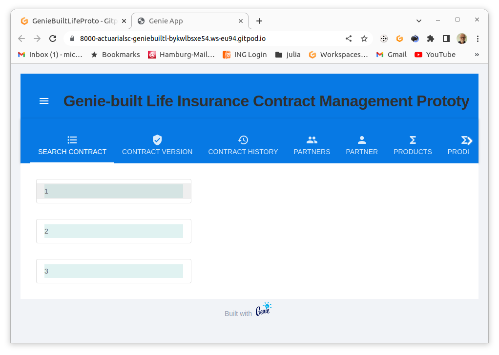

<!-- Output copied to clipboard! -->

<!-----

You have some errors, warnings, or alerts. If you are using reckless mode, turn it off to see inline alerts.
* ERRORs: 0
* WARNINGs: 0
* ALERTS: 6

Conversion time: 1.161 seconds.

Using this Markdown file:

1. Paste this output into your source file.
2. See the notes and action items below regarding this conversion run.
3. Check the rendered output (headings, lists, code blocks, tables) for proper
   formatting and use a linkchecker before you publish this page.

Conversion notes:

* Docs to Markdown version 1.0β34
* Tue Apr 18 2023 08:29:48 GMT-0700 (PDT)
* Source doc: Projekt GenieBuiltLifeProto
* This document has images: check for >>>>>  gd2md-html alert:  inline image link in generated source and store images to your server. NOTE: Images in exported zip file from Google Docs may not appear in  the same order as they do in your doc. Please check the images!

----->

>>>>>  gd2md-html alert:  ERRORs: 0; WARNINGs: 0; ALERTS: 6.

<ul style="color: red; font-weight: bold"><li>See top comment block for details on ERRORs and WARNINGs. <li>In the converted Markdown or HTML, search for inline alerts that start with >>>>>  gd2md-html alert:  for specific instances that need correction.</ul>

Links to alert messages:
<a href="#gdcalert1">alert1</a>
<a href="#gdcalert2">alert2</a>
<a href="#gdcalert3">alert3</a>
<a href="#gdcalert4">alert4</a>
<a href="#gdcalert5">alert5</a>
<a href="#gdcalert6">alert6</a>

>>>>> PLEASE check and correct alert issues and delete this message and the inline alerts.

# Projekt GenieBuiltLifeProto

Bei diesem Projekt handelt es sich um einen Versuch, eine Grundlage für ein Open Source System zur Verwaltung von Lebensversicherungen durch einen Versicherer zu erstellen.

## Entwurfsziele

dieses Projekts sind:

* performante und hoch skalierende  Web App zur
    * Dialogbearbeitung von Versicherungsverträgen und
    * Bereitstellung von Services für den Betrieb
* Lauffähigkeit auf Laptops wie auf Servern
* Nutzung von Cloud Entwicklungsumgebungen 
* Nutzung von Kooperationsplattformenin der Cloud
* Produkt-agnostisches Verwaltungssystem, d.h. maximale Kapselung produktspezifischen Wissens in produktspezifischen Komponenten
    * Rechnungsgrundlagen
    * Tariffunktionen
    * Metadaten tariflicher Funktionen zur Nutzung in Schnittstellen für Dialoge und Services.
    * Steuerung und Validierung von Eingaben für produktspezifische Geschäftsprozesse
* Verwendung einer aktuarsfreundlichen Entwicklungsumgebung hinsichtlich Programmiersprache und vorhandenen Bibliotheken
* Verwendung eines möglichst kohärenten Anwendungs-Stacks, der Tests über alle Ebenen von aktuariellen Funktionen über Persistenz bis zum Browser unterstützt, d.h. kein Umgebungsbruch, zwischen aktuarieller Produktentwicklung von und Entwicklung des Verwaltungssystems.
* Revisionssichere Speicherung von Verträgen durch bitemporale Persistierung

## Funktionsumfang des Prototyps

### Funktionsumfang API

Bitemporale CRUD- Aktionen für das gesamte Datenmodell.

### Funktionsumfang WebUI

#### Funktionsbereich Search Contracts

#### Anzeige einer Liste von Vertrags-IDs.

screenshot: Contracts tab

Anklicken wechselt in die Anzeige der neuesten Vertragsversion.

#### Funktionsbereich Contract Version

Anzeige / Bearbeitung von Vertragsversionen.

Das Bearbeiten erfordert einen aktiven Workflow (Transaktion). Dieser entsteht durch Anlegen eines neuen Vertrags, oder durch Eröffnen einer Vertragsmutation.

Ohne geladenen Vertrag wird der Button zum Anlegen eines Vertrages angezeigt.

>>>>>  gd2md-html alert: inline image link here (to images/image2.png). Store image on your image server and adjust path/filename/extension if necessary.  (<a href="#">Back to top</a>)(<a href="#gdcalert3">Next alert</a>) >>>>> 

>>>>>  gd2md-html alert: inline image link here (to images/image3.png). Store image on your image server and adjust path/filename/extension if necessary.  (<a href="#">Back to top</a>)(<a href="#gdcalert4">Next alert</a>) >>>>> 

Wurde ein unbearbeiteter Vertrag in der Suche ausgewählt worden, erscheint der Button zum Eröffnen einer Mutation.

>>>>>  gd2md-html alert: inline image link here (to images/image4.png). Store image on your image server and adjust path/filename/extension if necessary.  (<a href="#">Back to top</a>)(<a href="#gdcalert5">Next alert</a>) >>>>> 

In beiden Fällen muss der Gültigkeitsbeginn angeben werden. Danach erscheint der Vertrag als in Bearbeitung. 

>>>>>  gd2md-html alert: inline image link here (to images/image5.png). Store image on your image server and adjust path/filename/extension if necessary.  (<a href="#">Back to top</a>)(<a href="#gdcalert6">Next alert</a>) >>>>> 

Dieser Zustand bleibt erhalten bis der Workflow abgebrochen (rollback) oder vollendet wird (commit).

>>>>>  gd2md-html alert: inline image link here (to images/image6.png). Store image on your image server and adjust path/filename/extension if necessary.  (<a href="#">Back to top</a>)(<a href="#gdcalert7">Next alert</a>) >>>>> 

Danach wird ie Version als in Bearbeitung angezeigt:

#### Funktionsbereich History

#### Funktionsbereich Search Partners

#### Funktionsbereich Partner

#### Funktionsbereich Search Product

#### Funktionsbereich Product
