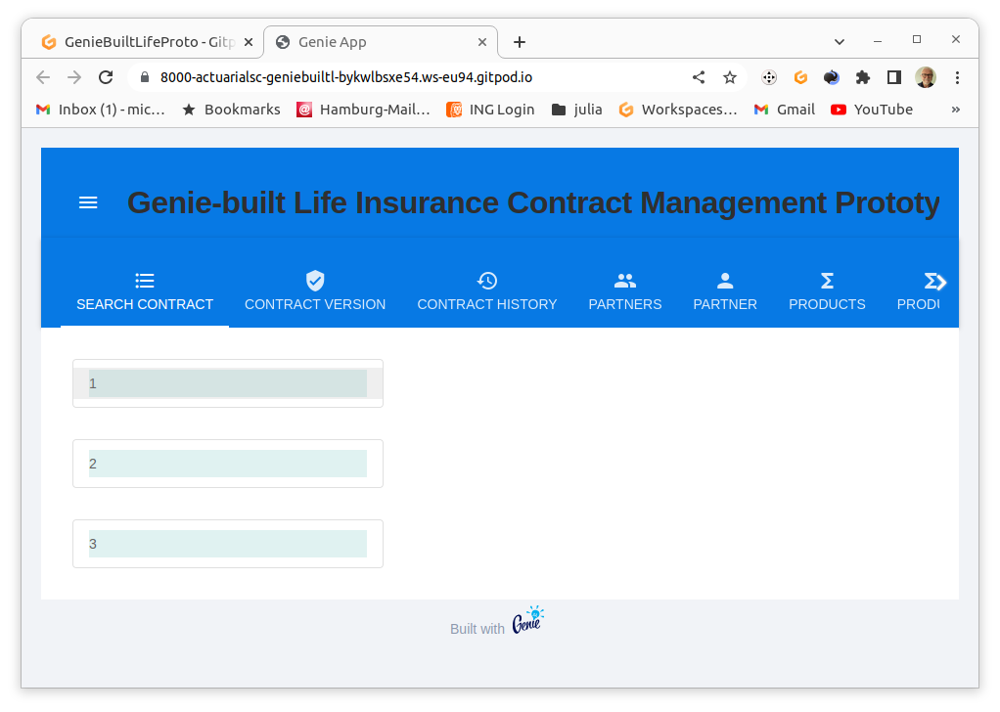
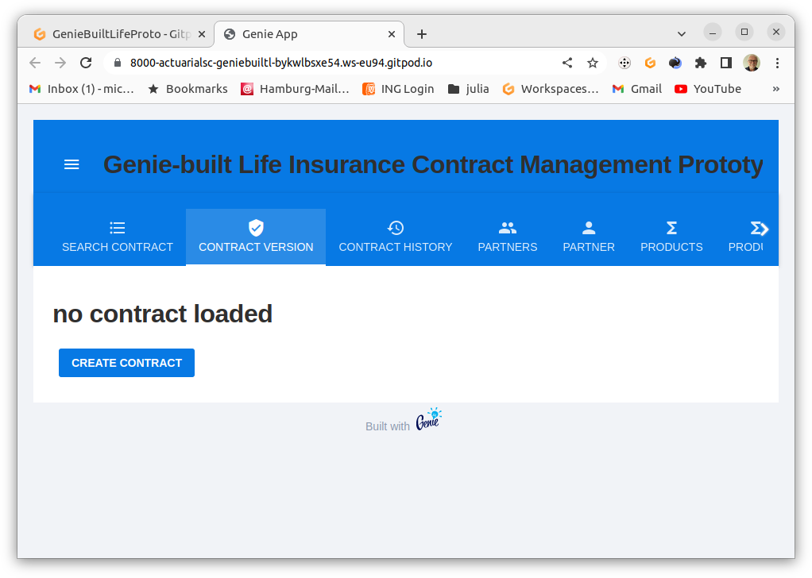
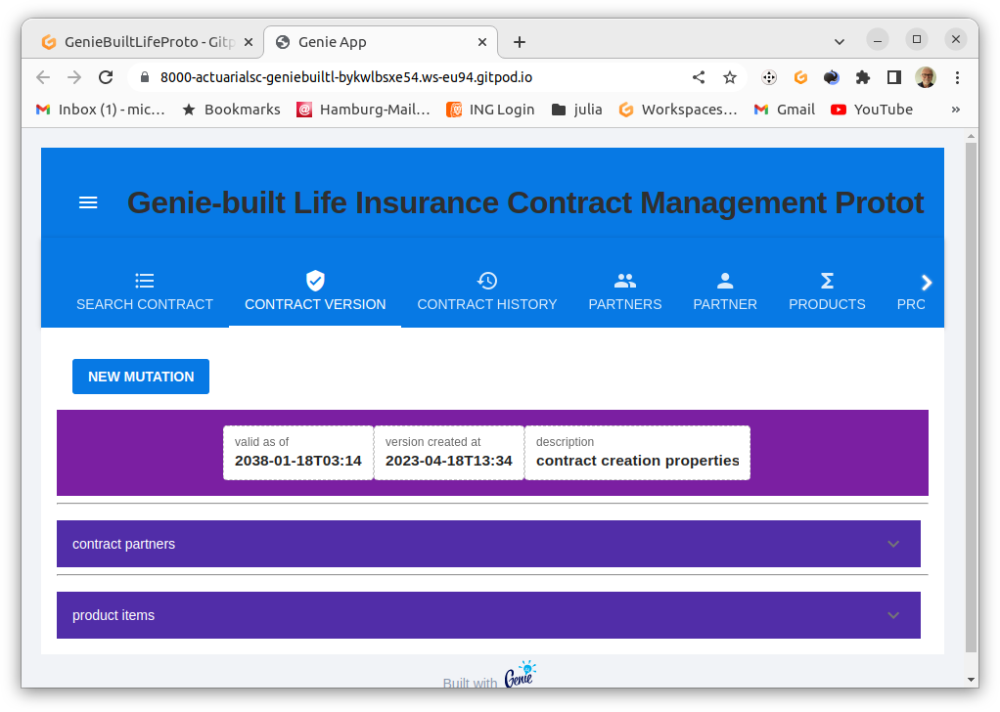
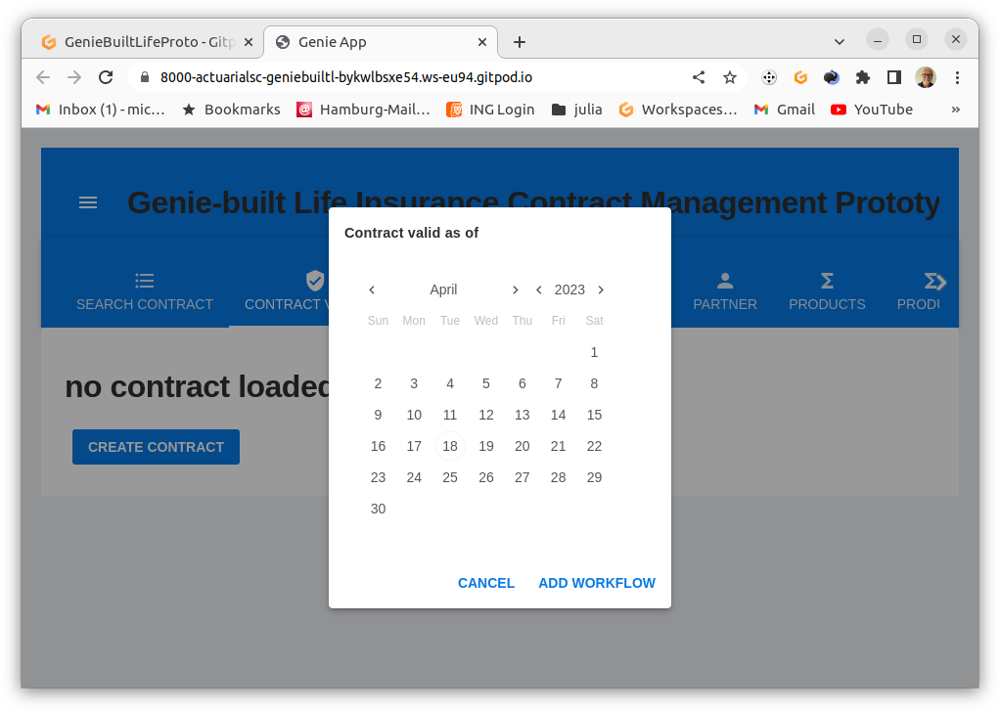
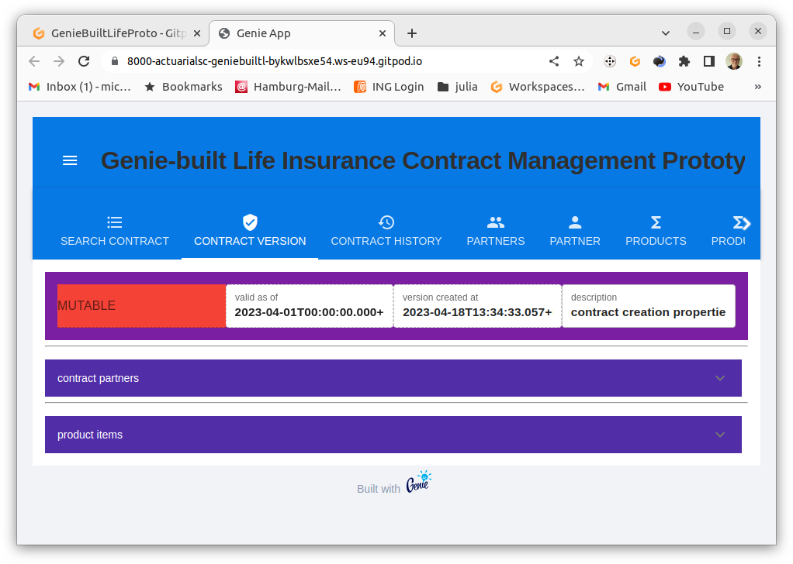
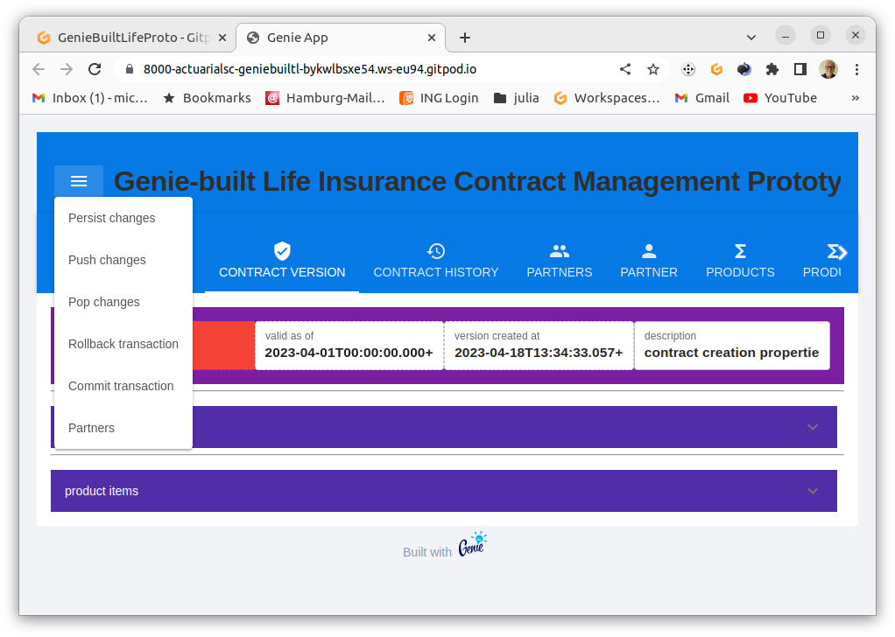

# Projekt GenieBuiltLifeProto
Bei diesem Projekt handelt es sich um einen Versuch, eine Grundlage für ein Open Source System zur Verwaltung von Lebensversicherungen durch einen Versicherer zu erstellen.

## Entwurfsziele
dieses Projekts sind:
* performante und hoch skalierende  Web App zur
    * Dialogbearbeitung von Versicherungsverträgen und
    * Bereitstellung von Services für den Betrieb
* Lauffähigkeit auf Laptops wie auf Servern
* Nutzung von Cloud Entwicklungsumgebungen 
* Nutzung von Kooperationsplattformenin der Cloud
* Produkt-agnostisches Verwaltungssystem, d.h. maximale Kapselung produktspezifischen Wissens in produktspezifischen Komponenten
    * Rechnungsgrundlagen
    * Tariffunktionen
    * Metadaten tariflicher Funktionen zur Nutzung in Schnittstellen für Dialoge und Services.
    * Steuerung und Validierung von Eingaben für produktspezifische Geschäftsprozesse
* Verwendung einer aktuarsfreundlichen Entwicklungsumgebung hinsichtlich Programmiersprache und vorhandenen Bibliotheken
* Verwendung eines möglichst kohärenten Anwendungs-Stacks, der Tests über alle Ebenen von aktuariellen Funktionen über Persistenz bis zum Browser unterstützt, d.h. kein Umgebungsbruch, zwischen aktuarieller Produktentwicklung von und Entwicklung des Verwaltungssystems.
* Revisionssichere Speicherung von Verträgen durch bitemporale Persistierung
## Funktionsumfang des Prototyps
### Funktionsumfang API
Bitemporale CRUD- Aktionen für das gesamte Datenmodell.
### Funktionsumfang WebUI
#### Funktionsbereich Search Contracts
#### Anzeige einer Liste von Vertrags-IDs.

screenshot: Contracts tab

Anklicken wechselt in die Anzeige der neuesten Vertragsversion.

#### Funktionsbereich Contract Version

Anzeige / Bearbeitung von Vertragsversionen.

Das Bearbeiten erfordert einen aktiven Workflow (Transaktion). Dieser entsteht durch Anlegen eines neuen Vertrags, oder durch Eröffnen einer Vertragsmutation.

Ohne geladenen Vertrag wird der Button zum Anlegen eines Vertrages angezeigt.

screenshot: Contract version: no contract loaded

Wurde ein unbearbeiteter Vertrag in der Suche ausgewählt worden, erscheint der Button zum Eröffnen einer Mutation.

screenshot: Contract version: contract immutable

In beiden Fällen muss zur Eröffnung eines Workflows der Gültigkeitsbeginn angeben werden.

screenshot: Contract version: open contract workflow

Danach erscheint der Vertrag als in Bearbeitung. 

screenshot: Contract version: contract mutable

Dieser Zustand bleibt erhalten bis
- der Workflow abgebrochen (rollback) oder
- vollendet wird (commit)
- Weitere workflow-bezogene Kommandos bieten
    - Kellern des Änderungsstandes (push)
    - Zurückholen des Änderungsstandes (pop)
    - Persistieren des Änderungsstandes (persist). Nach dem Persistieren 
ist der Ändderungskeller leer.

screenshot: Contract version: Workflow Kommandos

##### Funktionsbereich Contract Version - contract partners
Anklicken öffnet den Abschnitt zur Anzeige / Bearbeitung von Vertragspartnerbeziehungen.

##### Funktionsbereich Contract Version - product items
Anklicken öffnet den Abschnitt zur Anzeige / Bearbeitung von Produktpositionen.

##### Funktionsbereich Contract Version - product items - tariff items

Anklicken öffnet den Abschnitt zur Anzeige / Bearbeitung von Tarifpositionen.

###### Funktionsbereich Contract Version - product items - tariff items - tariff item partners

Anklicken öffnet den Abschnitt zur Anzeige / Bearbeitung von Partnerbeziehungen zu Tariffpositionen.

#### Funktionsbereich History

#### Funktionsbereich Search Partner

### Funktionsbereich Partner

#### Funktionsbereich Search Product

#### Funktionsbereich Product
