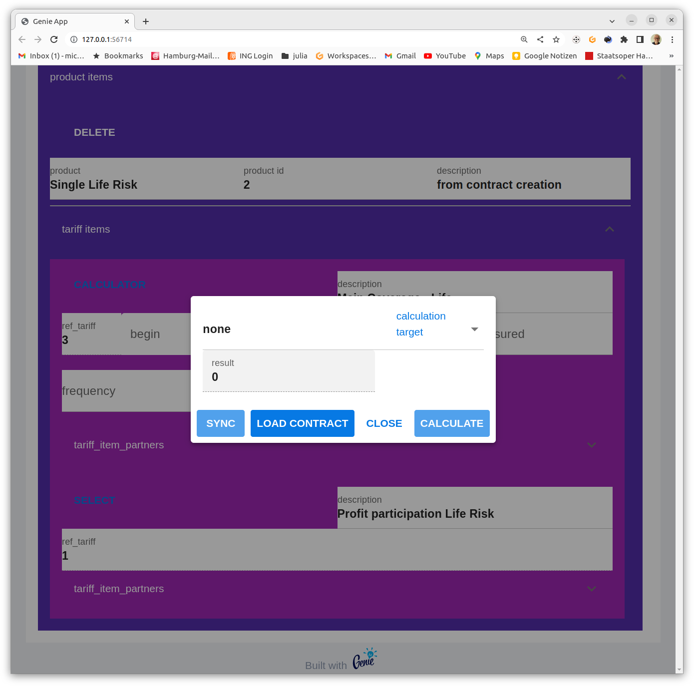
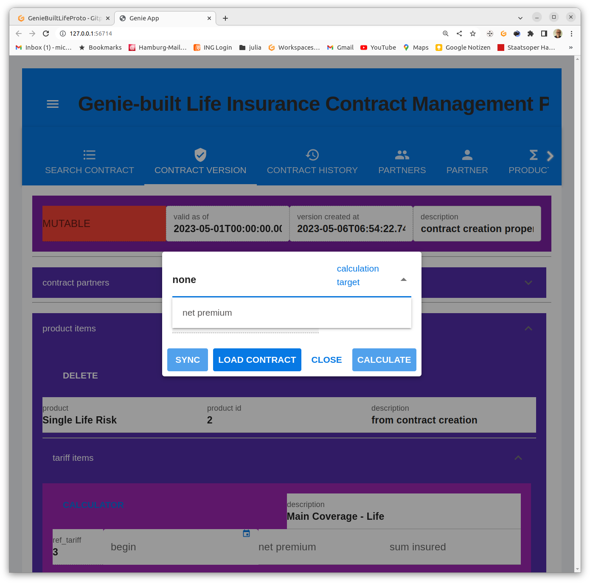
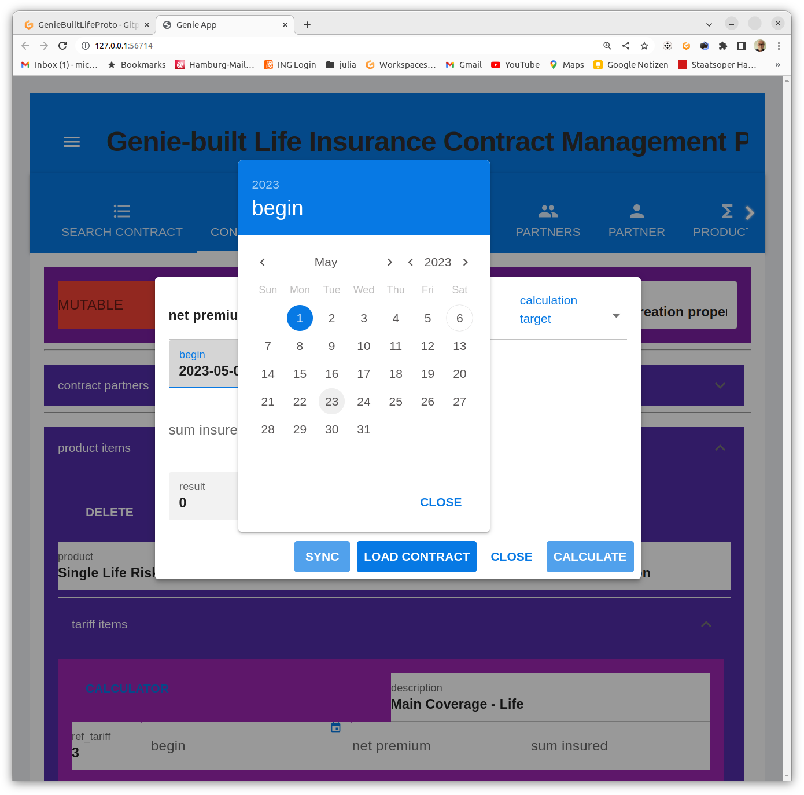
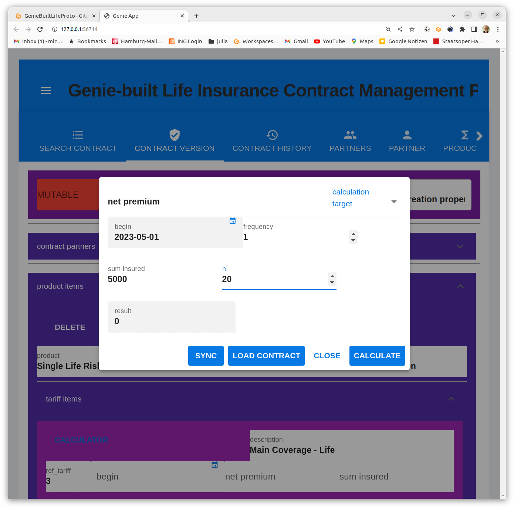

# GenieBuiltLifeProto

[](README.md)
[](https://gitpod.io/#https://github.com/Actuarial-Sciences-for-Africa-ASA/GenieBuiltLifeProto)


## [Installation und Start](#installation-und-start)

#Projekt GenieBuiltLifeProto
Bei diesem Projekt handelt es sich um einen Versuch, eine Grundlage für ein Open Source System zur Verwaltung von Lebensversicherungen durch einen Versicherer zu erstellen.

## 1. Entwurfsziele

dieses Projekts sind:

* performante und hoch skalierende  Web App zur* Dialogbearbeitung von Versicherungsverträgen und
* Bereitstellung von Services für den Betrieb
* Lauffähigkeit auf Laptops wie auf Servern
* Nutzung von Cloud Entwicklungsumgebungen 
* Nutzung von Kooperationsplattformenin der Cloud
* Produkt-agnostisches Verwaltungssystem, d.h. maximale Kapselung produktspezifischen Wissens in produktspezifischen Komponenten
  * Rechnungsgrundlagen
  * Tariffunktionen
  * Metadaten tariflicher Funktionen zur Nutzung in Schnittstellen für Dialoge und Services.
  * Steuerung und Validierung von Eingaben für produktspezifische Geschäftsprozesse
* Verwendung einer aktuarsfreundlichen Entwicklungsumgebung hinsichtlich Programmiersprache und vorhandenen Bibliotheken
* Verwendung eines möglichst kohärenten Anwendungs-Stacks, der Tests über alle Ebenen von aktuariellen Funktionen über Persistenz bis zum Browser unterstützt, d.h. kein Umgebungsbruch, zwischen aktuarieller Produktentwicklung von und Entwicklung des Verwaltungssystems.
* Revisionssichere Speicherung von Verträgen durch bitemporale Persistierung

## 2. Funktionsumfang des Prototyps

### 2.1 Funktionsumfang API

Bitemporale CRUD- Aktionen für das gesamte Datenmodell.

### 2.2 Funktionsumfang WebUI

### 2.2.1 Funktionsbereich Search Contracts

#### Anzeige einer Liste von Vertrags-IDs.

<details >
<summary>screenshot: Contracts tab</summary>
<p>

</p>
</details>
Anklicken wechselt in die Anzeige der neuesten Vertragsversion.

### 2.2.2 Funktionsbereich Contract Version

#### Anzeige / Bearbeitung von Vertragsversionen.

Das Bearbeiten erfordert einen aktiven Workflow (Transaktion). Dieser entsteht durch Anlegen eines neuen Vertrags, oder durch Eröffnen einer Vertragsmutation.

Ohne geladenen Vertrag wird der Button zum Anlegen eines Vertrages angezeigt.
<details >
<summary>screenshot: Contract version: no contract loaded</summary>
<p>

</p>
</details>
Wurde ein unbearbeiteter Vertrag in der Suche ausgewählt worden, erscheint der Button zum Eröffnen einer Mutation.
<details >
<summary>screenshot: Contract version: contract immutable</summary>
<p>

</p>
</details>
In beiden Fällen muss zur Eröffnung eines Workflows der Gültigkeitsbeginn angeben werden.
<details >
<summary>screenshot: Contract version: open contract workflow</summary>
<p>

</p>
</details>
Danach erscheint der Vertrag als in Bearbeitung. 
<details >
<summary>screenshot: Contract version: contract mutable</summary>
<p>

</p>
</details>
<details >
<summary>screenshot: Contract search: mutable contracts shown in red</summary>
<p>

</p>
</details>

Dieser Zustand bleibt erhalten bis

* der Workflow abgebrochen (rollback) oder
* vollendet wird (commit)
* Weitere workflow-bezogene Kommandos bieten
  * Kellern des Änderungsstandes (push)
  * Zurückholen des Änderungsstandes (pop)
  * Persistieren des Änderungsstandes (persist). Nach dem Persistieren 
ist der Ändderungskeller leer.

<details >
<summary>screenshot: Contract version: Workflow Kommandos</summary>
<p>

</p>
</details>
<br>

### 2.2.1 Funktionsbereich Contract Version - contract partners

Anklicken öffnet den Abschnitt zur Anzeige / Bearbeitung von Vertragspartnerbeziehungen.
<details >
<summary>screenshot: Contract version: contract partners</summary>
<p>

</p>
</details>

Wenn der Vertrag mutierbar ist

* Auswahl einer Vertragspartnerrolle und
* eines Partners
  
aktivieren den Button zum Einfügen einer neuen Partnerbeziehung].

<details >
<summary>screenshot: Contract version: Auswahl Partnerrolle</summary>
<p></p>
</details>
<details >
<summary>screenshot: Contract version: Auswahl Partner</summary>
<p></p>
</details>
</details>
<details >
<summary>screenshot: Contract version: Button zum Einfügen einer neuen Partnerbeziehung</summary>
<p></p>
</details>
<details >
<summary>screenshot: Contract version: Neue Partnerbeziehung eingefügt</summary>
<p></p>
</details>

### 2.2.2  Funktionsbereich Contract Version - product items

Anklicken öffnet den Abschnitt zur Anzeige / Bearbeitung von Produktpositionen.
<details >
<summary>screenshot: product items expanded</summary>
<p>

</p>
</details>
### 2.2.2.1 Funktionsbereich Contract Version - product items - tariff items

Anklicken öffnet den Abschnitt zur Anzeige / Bearbeitung von Tarifpositionen.

<details >
<summary>screenshot: Tarifpositionen aufgeklappt</summary>
<p>

</p>
</details>

Anklicken des Buttons "select" ändert den Button in "calculator"
<details >
<summary>screenshot: Tarifposition selektiert </summary>
<p>

</p>
</details>

Anklicken des Buttons "calculator" Berechnungsfensteröffnet das Berechnungsfenster:
<details >
<summary>screenshot: Tarifrechner gestartet </summary>
<p>

</p>
</details> 
Es können verschiedene Berechnungsziele vorgegeben werden.
<details >
<summary>screenshot: Tarifrechner gestartet </summary>
<p>

</p>
</details>

Nach Vorgabe des Berechnungsziels können die Parameter eingegeben werden.
<details>
<summary>screenshot: Berechnungsziel vorgegeben </summary>
<p>

</p>
</details>

Eingabedialog 

<details >
<summary>screenshot: Eingabedialog </summary>
<p>

</p>
</details>


Wenn alle obligatorischen Parameter belegt sind, kann gerechnet werden.
<details >
<summary>screenshot: Berechnungsaufruf </summary>
<p>

</p><p>

</p>
</details>

Parameter und Berechnungsergebnis können in die entsprechenden, d.h. ggf. vorhandenen gleichnamigen, Vertragsfelder synchroniert werden
<details >
<summary>screenshot: Syunchronisierung mit dem Vertragsstand </summary>
<p>

</p>
</details>

### 2.2.2.1.1 Funktionsbereich Contract Version - product items - tariff items - tariff item partners

Anklicken öffnet den Abschnitt zur Anzeige / Bearbeitung von Partnerbeziehungen zu Tariffpositionen.

### 2.3 Funktionsbereich History

### 2.4 Funktionsbereich Search Partner

### 2.5 Funktionsbereich Partner
Anzeige / Bearbeitung von Vertragsversion 
### 2.6 Funktionsbereich Search Product

### 2.7 Funktionsbereich Product

## 3 Installation und Start

### 3.1 Start unter gitpod

[](https://gitpod.io/#https://github.com/Actuarial-Sciences-for-Africa-ASA/GenieBuiltLifeProto)

Beim Start des gitpod workspace wird die Datenbank vorinstalliert und drei Produkte / Verträge werden geladen. VS Code wird gestartet.

### 3.1.1 Web Server starten

In der Terminalansicht Julia starten
    ```julia --project=.```
und das Startskript laden>
 ```include("run.jl")```
Hier braucht man etwas Geduld, die Anwendung wird dann schon noch reaktiv :-).

### 3.1.2 Browser Sitzung  starten

VS Code startet automatisch eine Browsersityung. Falls nicht, die Portanzeige
 ```Menu -> View -> Open View -> Ports```
auswählen und den Port für den Application Web Server anklicken.

BE PATIENT! Intialization takes some time. It gets reactive then!

Three contracts are preloaded: pension, SingleLifeRisk, JointLifeRisk
