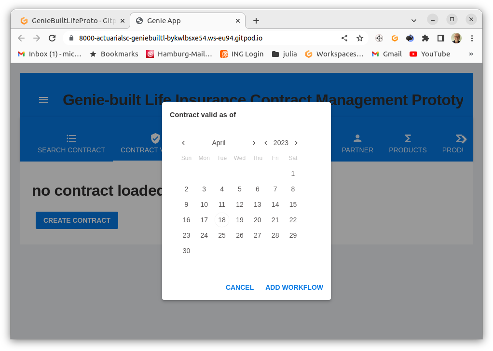
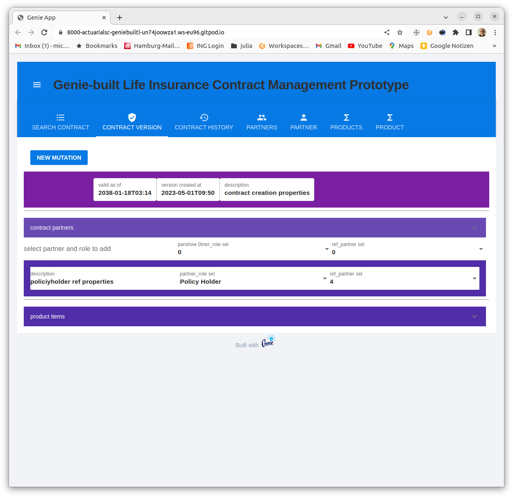

# Ceci a été traduit automatiquement. Merci de nous aider à faire les corrections nécessaires !

[ ](README.md)
[ ](README.fr.md)
[ ](README.de.md)


## [installation et démarrage](#3-installation-et-démarrage)

#Projekt GenieBuiltLifeProto
Ce projet est une tentative de créer les bases d'un système open source pour la gestion des polices d'assurance-vie par un assureur.

### 1. objectifs de conception

de ce projet sont :

* une application web performante et hautement évolutive pour le traitement en dialogue des contrats d'assurance et.
* la fourniture de services pour l'exploitation
* possibilité d'exécution sur des ordinateurs portables ainsi que sur des serveurs
* utilisation d'environnements de développement en nuage 
* Utilisation de plateformes de collaboration dans le nuage
* Système de gestion agnostique, c'est-à-dire encapsulation maximale des connaissances spécifiques au produit dans des composants spécifiques au produit.
  * Bases de calcul
  * Fonctions tarifaires
  * Métadonnées des fonctions tarifaires à utiliser dans les interfaces pour les dialogues et les services.
  * Contrôle et validation des données d'entrée pour les processus opérationnels spécifiques au produit
* Utilisation d'un environnement de développement convivial pour les actuaires en ce qui concerne le langage de programmation et les bibliothèques existantes.
* Utilisation d'une pile d'applications aussi cohérente que possible et supportant des tests à tous les niveaux, depuis les fonctions actuarielles jusqu'à la persistance dans le navigateur, c'est-à-dire sans rupture environnementale entre le développement du produit actuariel et le développement du système de gestion.
* Stockage des contrats à l'épreuve des audits grâce à la persistance bitemporale.

## 2. champ d'application fonctionnel du prototype

### 2.1 Champ d'application fonctionnel de l'API

Actions CRUD bitemporales pour l'ensemble du modèle de données.

### 2.2 Champ d'application des fonctions de l'interface WebUI

### 2.2.1 Domaine fonctionnel Recherche de contrats

#### Affichage d'une liste d'identifiants de contrats.

<details>
<summary>Capture d'écran : Onglet Contrats</summary>
<p>

</p>
</details>
En cliquant, on passe à l'affichage de la dernière version du contrat.

### 2.2.2 Domaine fonctionnel de la version du contrat

#### Affichage/modification des versions de contrat.

L'édition nécessite un flux de travail actif (transaction). Celui-ci est créé par la création d'un nouveau contrat ou par l'ouverture d'une mutation de contrat.

Si le contrat n'est pas chargé, le bouton permettant de créer un contrat s'affiche.
<details>
<summary>capture d'écran : Version du contrat : aucun contrat chargé</summary>
<p>

</p>
</details>
Si un contrat non traité a été sélectionné dans la recherche, le bouton pour ouvrir une mutation apparaît.
<details>
<summary>capture d'écran : Version du contrat : contrat immuable</summary>
<p>

</p>
</details>
Dans les deux cas, pour ouvrir un workflow, la date de début de validité doit être spécifiée.
<details>
<summary>capture d'écran : Version du contrat : ouvrir le flux de travail du contrat</summary>
<p>

</p>
</details>
Ensuite, le contrat apparaîtra comme étant en cours de traitement. 
<details>
<summary>capture d'écran : Version du contrat : contrat mutable</summary>
<p>

</p>
</details>
<details>
<summary>capture d'écran : Recherche de contrats : les contrats mutables apparaissent en rouge</summary>
<p>

</p>
</details>

Cet état est conservé jusqu'à ce que

* le flux de travail est annulé ou
* validé.

 D'autres commandes liées au flux de travail fournissent
  * de pousser l'état des changements sur une pile  
  * de retirer l'état des changements de la pile  
  * persister l'état des changements, ce qui vide la pile des changements.

<details>
<summary>capture d'écran : Version du contrat : Workflow Kommandos</summary>
<p>

</p>
</details>
<br>

### 2.2.1 Funktionsbereich Contract Version - contract partners

Clicking opens the section for viewing / editing contractor relationships.

<details >
<summary>screenshot: Contract version: contract partners</summary>
<p>

</p>
</details>

If the contract is mutable.

* Selection of a contract partner role and
* a partner
  
activate the button to insert a new partner relationship].

<details>
<summary>screenshot: Contract version: partner role selection</summary>.
<p></p>
</details>
<details>
<summary>screenshot: Contract version: select partner</summary>
<p></p>
</details>
</details>
<details>
<summary>Capture d'écran : Version du contrat : bouton permettant d'insérer une nouvelle relation de partenariat</summary>.
<p></p>
</details>
<details>
<summary>capture d'écran : Version du contrat : ajout d'une nouvelle relation de partenariat</summary>
<p></p> <p>Détails
</details>

### 2.2.2 Version du contrat - zone fonctionnelle des éléments du produit.

Un clic ouvre la section permettant de visualiser/modifier les éléments du produit.
<details>
<summary>capture d'écran : éléments de produit développés</summary>.
<p>

</p>
</details>
### 2.2.2.1 Version du contrat - éléments du produit - éléments du tarif domaine fonctionnel.

Un clic ouvre la section permettant de visualiser/modifier les postes tarifaires.

<details>
<summary>Capture d'écran : Postes tarifaires développés</summary>
<p>

</p>
</details>

En cliquant sur le bouton "select", le bouton devient "calculator"
<details>
<summary>capture d'écran : Élément tarifaire sélectionné </summary>
<p>

</p>
</détails>

Un clic sur le bouton "calculatrice" fenêtre de calcul ouvre la fenêtre de calcul :
<details>
<summary>capture d'écran : Calculateur de tarifs démarré</summary>
<p>

</p>
</details> 
Différents objectifs de calcul peuvent être spécifiés.
<details>
<summary>capture d'écran : Calculateur de tarifs démarré </summary>
<p>

</p>
</details>

Après avoir spécifié la cible de calcul, les paramètres peuvent être saisis.
<details>
<summary>capture d'écran : Cible de calcul spécifiée</summary>
<p>

</p>
</details>

Dialogue de saisie 

<details>
<summary>capture d'écran : Dialogue de saisie </summary>
<p>

</p>
</détails>


Lorsque tous les paramètres obligatoires sont occupés, le calcul peut être effectué.
<details>
<summary>capture d'écran : Appel au calcul </summary>
<p>

</p><p>
 </p><p>Les calculs peuvent être appelés.
</p>
</details>

Les paramètres et le résultat du calcul peuvent être synchronisés dans les champs contractuels correspondants, c'est-à-dire existants si nécessaire, portant le même nom.
<details>
<summary>capture d'écran : Synchronisation avec le statut du contrat</summary>.
<p>

</p>
</details>

### 2.2.2.1.1 Version du contrat - postes de produits - postes tarifaires - partenaires des postes tarifaires domaine fonctionnel.

Un clic ouvre la section permettant d'afficher / de modifier les relations de partenariat pour les postes tarifaires.
<details>
<summary>Capture d'écran : Partenaires des postes tarifaires</summary>
<p>

</p>
</details>

### 2.3 Domaine fonctionnel de l'historique
Cliquer sur un nœud de version ouvre la vue de la version
<details>
<summary>capture d'écran : Sélection de la version</summary>
<p>

</p>
<p>
 </p> <p>Img src="docs/images/image6.png" alt="show uncommitted workflow">
</p>
<p>

</p>
<p>

</p>
</details>

Les mutations rétroactives ombrent les mutations saisies précédemment avec une date d'entrée en vigueur identique ou ultérieure.
<details>
<summary>capture d'écran : Transaction rétroactive</summary>.
<p>

</p>
<p>

</p>
</details>

### 2.3.1 Rechercher le domaine fonctionnel du partenaire.
#### Afficher une liste d'identifiants de partenaires.

<details>
<summary>Capture d'écran : Onglet Partenaires</summary>
<p>

</p>
</details>
En cliquant, on passe à l'affichage de la dernière version du partenaire.

### 2.3.2 Domaine fonctionnel Partenaires

Affichage de la version du partenaire.

La gestion des partenaires est rudimentaire. Elle ne contient que les données tarifaires pertinentes sur les partenaires et l'édition n'est pas possible dans l'application web, mais uniquement via l'API du contrat [exemple : ici ](testAPI.jl).
<details>
<summary>capture d'écran : Onglet Versions des partenaires</summary>
<p>

</p>
</details>

### 2.3.3 Recherche dans le domaine fonctionnel des produits.
#### Afficher une liste d'identifiants de produits.

<details>
<summary>Capture d'écran : Onglet Produits</summary>
<p>

</p>
</details>
En cliquant, on passe à l'affichage de la dernière version du partenaire.

### 2.3.4 Domaine fonctionnel Produit

Affichage de la version du produit 
La gestion des produits est rudimentaire. Elle ne contient que les données tarifaires pertinentes sur les partenaires et l'édition n'est pas possible dans l'application web, mais uniquement via l'API du contrat [exemple : ici ](testAPI.jl).

#### 2.3.4.1 Domaine fonctionnel du produit - champ des paramètres tarifaires.

La sémantique de ce champ ressort clairement des scripts du débogueur de tarifs.

[Pension](debugcalcPEN.jl)
[SingleLifeRisk](debugcalcSLR.jl)
[JointLifeRiskgh](debugcalcJLR.jl)

#### 2.3.4.2 Domaine fonctionnel du produit - champ des attributs du contrat

Ce champ définit les attributs dynamiques des postes tarifaires.

<details>
<summary>capture d'écran : Onglet Productversion</summary>
<p>

</p>
</details>

## 3 installation et démarrage

Le paquet a besoin d'une base de données POSTGRES, du [dossier de configuration](db) et des données du produit [voir : testScript](testAPI.jl)
### 3.1 Démarrage sous gitpod

[ ](https://gitpod.io/#https://github.com/Actuarial-Sciences-for-Africa-ASA/GenieBuiltLifeProto)

Lorsque l'espace de travail gitpod est démarré, la base de données est préinstallée et trois produits/contrats sont chargés. Le code VS est lancé.

### 3.1.1 Démarrer le serveur Web

Dans le terminal, lancez Julia
    ``julia --projet=.````
et chargez le script de démarrage
 ```include("run.jl")```
Ici il faut un peu de patience, l'application va devenir réactive :-).

### 3.1.2 Démarrer une session de navigation

VS Code démarre automatiquement une session de navigation. Si ce n'est pas le cas, le port affiche
 ``Menu -> Vue -> Ouvrir la vue -> Ports``
et cliquez sur le port de l'Application Web Server.

SOYEZ PATIENT ! L'initialisation prend un certain temps. Ensuite, il devient réactif !

Trois contrats sont préchargés : pension, SingleLifeRisk, JointLifeRisk.